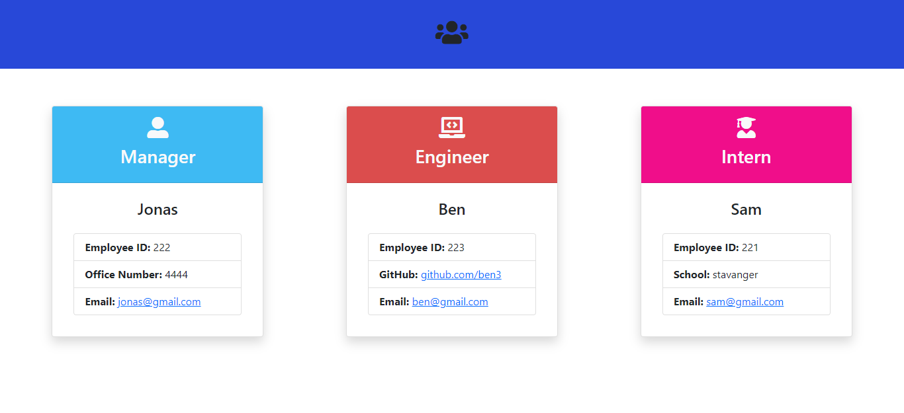
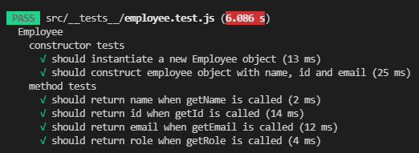
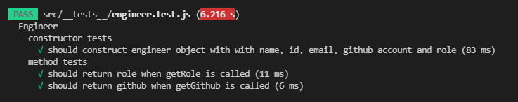
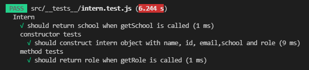
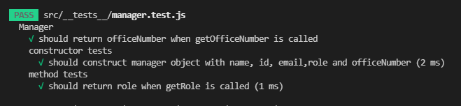
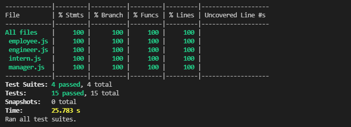

# TEAM-PROFILE-GENERATOR

## Click [here](https://drive.google.com/file/d/1RT7uRCGHBfOVZU2XJFe_QtTTFuNgeiyh/view?usp=sharing) to watch my video recording

## Description

Our task was to build to build a Node.js command-line application that takes in information about employees on a software engineering team, then generates an HTML webpage that displays summaries for each person. Testing is key to making code maintainable, so also we needed to write a unit test for every part of our code and ensure that it passes each test.

---

## Requirements

For development, you will only need Node.js and a node global package installed in your environment

## Getting started

    $ git clone https://github.com/otivisan22/TEAM-PROFILE-GENERATOR
    $ cd TEAM-PROFILE-GENERATOR
    $ npm i

## What did we do?

- Install npm i
- Install npm i jest:watch
- Install npm i jest
- Install npm i inquirer
- Developed the team profile generator by creating the employee, engineer, intern and manager classes and after tested all the classes with jest test
- npm run test:watch for the first round of tests
- all tests has been successful
- Using inquirer we have generated/prompt the questions
- Created the init function in order to start the app and render the questions and answers
- Used w while loop in order to destructed the object that each team member needed to rendered
- The html file which is rendering the team profile card can be seen

  

## Running the project

    $ npm start

## Testing

    $ npm run test:watch
    $ npm run tests

